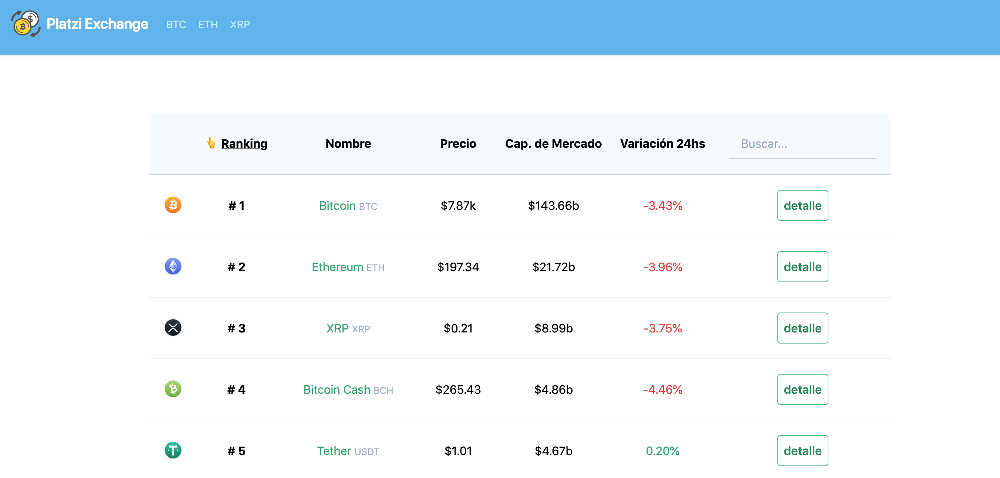

# vue-exchange


Platzi Exchange is a platform that will help you visualize all cryptocurrencies and their values ​​in real time using the advantages of Vue.js, a framework for developing reactive and component-based websites widely used in the world of web development. 

This project has been carried out through a Platzi platform course.

You can run demo here: https://platzi-exchange-vuejs.netlify.com/




## Project setup
```
npm install
```

### Compiles and hot-reloads for development
```
npm run serve
```

### Compiles and minifies for production
```
npm run build
```

### Lints and fixes files
```
npm run lint
```

### Customize configuration
See [Configuration Reference](https://cli.vuejs.org/config/).
